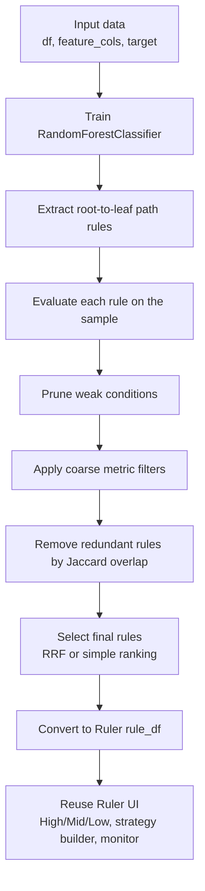

# inTrees Rule Mining Workflow

This document explains the inTrees rule mining workflow added to Ruler. The implementation is focused on rule production only: it extracts, evaluates, prunes, deduplicates, and selects rules. It does not train or expose the STEL prediction model.

## Why inTrees

The original Decision Tree and Random Forest buttons in Ruler extract simple threshold-style rules from tree splits. inTrees adds a fuller tree-ensemble interpretation workflow:

- extract complete root-to-leaf path rules from a tree ensemble
- simplify rules by pruning weak conditions
- remove rules that cover nearly the same samples
- select a compact set of high-quality rules
- return the same rule table schema already used by Ruler

An inTrees rule can contain multiple conditions:

```text
debt_ratio > 0.62 AND credit_score <= 580 AND overdue_count > 2
```

That makes it suitable for discovering interaction-style risk patterns that a single threshold rule may miss.

## End-to-End Flow



## Pipeline Steps

### 1. Train a Tree Ensemble

Ruler trains a `RandomForestClassifier` using the active sample and selected feature columns.

Key parameters are shared with the existing Rule Mining panel:

| UI control | inTrees meaning |
|---|---|
| `Min Leaf Ratio` | converted to `min_samples_leaf` |
| `Rule Depth` | `max_depth` for each tree and extracted rule length |
| `N Trees` | number of trees in the forest |
| `Feature Ratio` | feature subsampling for tree splits |

The tree settings directly control how many raw path rules can be produced. A single tree with depth `d` can produce up to `2^d` leaf paths, so a forest can grow quickly:

| Example | Raw path rule upper bound |
|---|---:|
| 50 trees, depth 3 | up to 400 |
| 50 trees, depth 4 | up to 800 |
| 100 trees, depth 5 | up to 3,200 |
| 100 trees, depth 8 | up to 25,600 |

For interactive notebook work, depth 3-4 and 30-100 trees are usually the right starting range.

### 2. Extract Root-to-Leaf Rules

The extractor walks each fitted sklearn tree recursively:

```text
left child  -> feature <= threshold
right child -> feature > threshold
```

When traversal reaches a leaf, all conditions collected along the path become one rule.

Example tree path:

```text
debt_ratio > 0.62
credit_score <= 580
overdue_count > 2
```

Extracted rule:

```text
debt_ratio > 0.62 AND credit_score <= 580 AND overdue_count > 2
```

The extracted rule also stores the leaf prediction. In this risk-control implementation, the metric stage keeps rules that predict the positive label, where `target = 1` is treated as the bad-sample label.

### 3. Evaluate Rule Metrics

Each rule is reapplied to the active dataset and measured with risk-oriented metrics.

| Metric | Meaning |
|---|---|
| `hit_samples` | number of rows hit by the rule |
| `hit_rate` | hit samples / total samples |
| `bad_rate` | bad samples among hit samples / hit samples |
| `recall_rate` | bad samples hit by the rule / all bad samples |
| `lift` | rule bad rate / overall bad rate |
| `len` | number of conditions in the rule |

These metrics are compatible with the rest of Ruler. The final output is converted back to the same schema used by Decision Tree and Random Forest rules:

```text
rule
hit_rate
bad_rate
lift
mask
var_count
```

### 4. Prune Weak Conditions

Path rules can become longer than a strategy analyst wants to review. The pruning step tries to remove conditions one by one while limiting quality loss.

For a bad-sample rule, quality loss is measured as an increase in error:

```text
error = 1 - bad_rate
```

The pruning step:

1. starts from the full path rule
2. tries removing one condition
3. recalculates the rule bad rate
4. keeps the shorter rule if the error increase is within `max_decay`
5. repeats until no more conditions can be safely removed

Default behavior:

| Parameter | Default | Meaning |
|---|---:|---|
| `max_decay` | `0.05` | maximum allowed absolute error increase |
| `type_decay` | `2` | absolute decay mode |

Example:

```text
Before pruning:
debt_ratio > 0.62 AND credit_score <= 580 AND overdue_count > 2
bad_rate = 0.31

After pruning:
debt_ratio > 0.62 AND overdue_count > 2
bad_rate = 0.29
```

If the bad-rate drop is acceptable, the shorter rule is kept.

### 5. Coarse Filtering

Before expensive overlap checks, Ruler applies a fast rule filter:

- minimum hit samples, derived from `min_hit_rate`
- minimum bad rate, derived from `overall_bad_rate * min_lift`
- maximum rule length, tied to `Rule Depth`
- a temporary top-k cap to reduce downstream runtime

This stage keeps the notebook responsive and prevents very low-support path rules from dominating the workflow.

### 6. Remove Redundant Rules

Two rules may be different textually but hit almost the same samples. inTrees removes redundant rules using Jaccard overlap:

```text
Jaccard(rule_a, rule_b) = intersection(hit_a, hit_b) / union(hit_a, hit_b)
```

If a candidate rule overlaps an already-kept rule above the threshold, it is dropped.

Default:

| Parameter | Default | Meaning |
|---|---:|---|
| `jaccard_thresh` | `0.85` | overlap threshold for redundancy |

Lower thresholds remove more rules and run faster. Higher thresholds keep more near-duplicate rules and can be slower.

### 7. Select Final Rules

Ruler uses RRF-style selection by default. It scores rules using three forces:

```text
RRF score = information gain * length penalty * overlap penalty
```

Information gain rewards rules that split the target distribution well. Length penalty rewards shorter rules. Overlap penalty discourages selecting rules that hit the same population as already-selected rules.

Key defaults:

| Parameter | Default | Meaning |
|---|---:|---|
| `n_rules` | `50` | maximum final rules returned to the UI |
| `rrf_min_gain` | `0.0` | minimum information gain |
| `rrf_lambda_len` | `0.02` | rule length penalty |
| `rrf_gamma_overlap` | `0.5` | overlap penalty during selection |

The selected rules are then sorted and returned to the Ruler interface.

## Output in Ruler

The inTrees button produces the same `rule_df` shape as the existing algorithms.

| Column | Description |
|---|---|
| `rule` | readable rule text joined by `AND` |
| `hit_rate` | percentage of samples hit by the rule |
| `bad_rate` | bad rate within hit samples |
| `lift` | bad-rate lift versus the full sample |
| `mask` | boolean hit array aligned to the active sample |
| `var_count` | number of rule conditions |
| `recall_rate` | bad-sample recall for the rule |
| `hit_samples` | number of hit rows |
| `source` | fixed value `inTrees` |
| `rrf_score` | present when RRF selection is used |

Because the output schema is compatible, the rest of Ruler works without special handling:

- High/Mid/Low Lift rule classification
- manual rule selection
- Greedy strategy integration
- Random Path strategy search
- strategy metrics and monitoring

## Practical Parameter Guidance

For a 100,000-row, 60-feature risk dataset, start with:

| Parameter | Suggested value |
|---|---:|
| `N Trees` | `50` to `100` |
| `Rule Depth` | `3` to `4` |
| `Min Leaf Ratio` | `0.01` to `0.02` |
| `Feature Ratio` | `0.5` |
| `n_rules` | `50` |
| `jaccard_thresh` | `0.80` to `0.90` |

If the run is slow, reduce depth first. Depth controls the maximum number of path rules exponentially and has the largest impact on runtime.

## What Is Not Included

The original inTrees literature also describes STEL, a prediction model trained on rule indicators. Ruler does not include STEL in this integration because this project is focused on strategy rule discovery and monitoring.

The current implementation stops at the final rule table:

```text
tree ensemble -> selected rules -> Ruler strategy workflow
```

It does not add:

- rule-indicator logistic regression
- STEL probabilities
- model scoring APIs
- prediction-threshold tuning

This keeps the integration aligned with Ruler's purpose: help analysts discover, compare, and combine business-readable risk rules.
